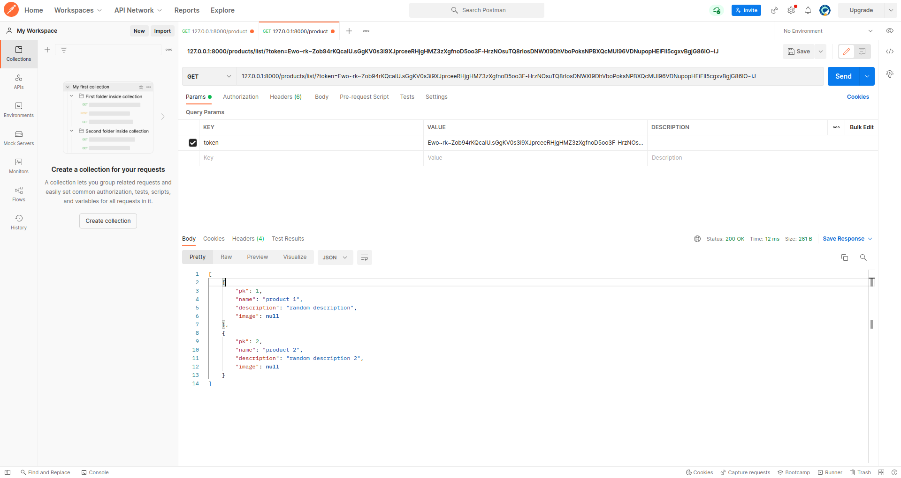
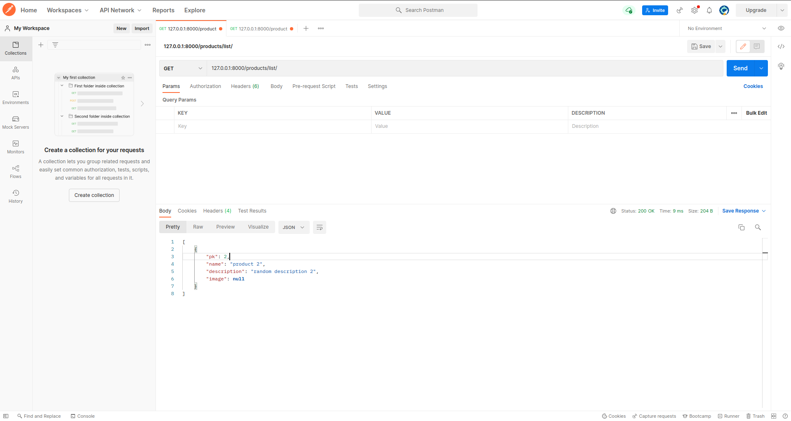

# REST сервис для интернет-магазина

Сервис для хранения продуктов, написан на Python3.10 с использованием FastAPI.

### Зависимости
 Отображены в файле `Pipfile`.
 
 Установка:
 ```bash
 $ pipenv install
 ```

### Запуск сервера

Из директории `/src`:

* С помощью pipenv
```bash
$ pipenv run uvicorn main:app --reload
```

* Или напрямую из виртуального окружения
```bash
uvicorn main:app --reload
```

### API

0. Открыть страницу с документацией: GET запрос `/`

1. Получить список продуктов: GET запрос `/products/list/`

2. Получить продукт по его id: GET запрос `/product/<product_id>`, необязательный параметр `token`

3. Добавить продукт: POST запрос `/product/add`, обязательные поля: `name`, `desctiption`, `private` и `image`, `token` (проверяется наличие такого токена)

4. Обновить продукт по id: PUT запрос `/product/<product_id>`, все поля из прошлого запроса, но не обязательные, кроме `token` (проверяется наличие такого токена)

5. Удалить продукт по id: DELETE запрос `/product/<product_id>`, обязательное поле `token` (проверяется наличие такого токена)

6. Зарегистрировать пользователя: POST запрос `/users/register_user/`, обязательные поля: `email`, `password`, `first_name`, `last_name`

7. Получить новый токен: POST запрос `/users/login/`, обязательные поля: `email`, `password`. Если пользователь существует и пароль правильный, в ответ отправляется новый токен.

Если пользователь получает список товаров или запрашивает один товар без токена (или предъявляет некорректный токен), и если есть пользователь с таким же ip адресом, через час после последнего запроса ему отправляется письмо.


Для отправки писем необходимо заполнить адрес и пароль в файле `config.py`.

Добавление, обновление, удаление продуков возможно только с корректным токеном.

### Пример с Postman
Есть два товара, один приватный, то есть показывается только авторизованному пользователю:

* Запрос с токеном

* Запрос без токена

